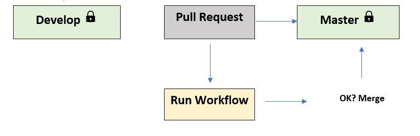

# React-app-testing-and-deployment-by-CI-CD-workflow


## Workflow

### Branches


- Install Dependencies
- Check code formatting
- Run Automated Test
- Upload Code Coverage as an Artifact
- Cache Dependencies

### Develop


- Install Dependencies
- Check code formatting
- Run Automated Test
- Upload Code Coverage as an Artifact
- Build Projects
- Upload Build as an Artifact
- Deploy to Staging server
- Cache Dependencies

### Master



- Install Dependencies
- Check code formatting
- Run Automated Test
- Upload Code Coverage as an Artifact
- Build Projects
- Upload Build as an Artifact
- Create a Release
- Deploy to Production server
- Upload Coverage to Codecov
- Cache Dependencies

## Step 1: Creating-ReactJS-Application

### Getting Started with Create React App

This project was bootstrapped with [Create React App](https://github.com/facebook/create-react-app).

### Available Scripts

In the project directory, you can run:

### `npm start`

Runs the app in the development mode.\
Open [http://localhost:3000](http://localhost:3000) to view it in your browser.

The page will reload when you make changes.\
You may also see any lint errors in the console.

### `npm test`

Launches the test runner in the interactive watch mode.\
See the section about [running tests](https://facebook.github.io/create-react-app/docs/running-tests) for more information.

### `npm run build`

Builds the app for production to the `build` folder.\
It correctly bundles React in production mode and optimizes the build for the best performance.

The build is minified and the filenames include the hashes.\
Your app is ready to be deployed!

See the section about [deployment](https://facebook.github.io/create-react-app/docs/deployment) for more information.

### `npm run eject`

**Note: this is a one-way operation. Once you `eject`, you can't go back!**

If you aren't satisfied with the build tool and configuration choices, you can `eject` at any time. This command will remove the single build dependency from your project.

Instead, it will copy all the configuration files and the transitive dependencies (webpack, Babel, ESLint, etc) right into your project so you have full control over them. All of the commands except `eject` will still work, but they will point to the copied scripts so you can tweak them. At this point you're on your own.

You don't have to ever use `eject`. The curated feature set is suitable for small and middle deployments, and you shouldn't feel obligated to use this feature. However we understand that this tool wouldn't be useful if you couldn't customize it when you are ready for it.

### Learn More

You can learn more in the [Create React App documentation](https://facebook.github.io/create-react-app/docs/getting-started).

To learn React, check out the [React documentation](https://reactjs.org/).

### Code Splitting

This section has moved here: [https://facebook.github.io/create-react-app/docs/code-splitting](https://facebook.github.io/create-react-app/docs/code-splitting)

### Analyzing the Bundle Size

This section has moved here: [https://facebook.github.io/create-react-app/docs/analyzing-the-bundle-size](https://facebook.github.io/create-react-app/docs/analyzing-the-bundle-size)

### Making a Progressive Web App

This section has moved here: [https://facebook.github.io/create-react-app/docs/making-a-progressive-web-app](https://facebook.github.io/create-react-app/docs/making-a-progressive-web-app)

### Advanced Configuration

This section has moved here: [https://facebook.github.io/create-react-app/docs/advanced-configuration](https://facebook.github.io/create-react-app/docs/advanced-configuration)

### Deployment

This section has moved here: [https://facebook.github.io/create-react-app/docs/deployment](https://facebook.github.io/create-react-app/docs/deployment)

### `npm run build` fails to minify

This section has moved here: [https://facebook.github.io/create-react-app/docs/troubleshooting#npm-run-build-fails-to-minify](https://facebook.github.io/create-react-app/docs/troubleshooting#npm-run-build-fails-to-minify)

## Step 2: Deploy-Application-using-Surge

### Surge link

- [Surge](https://surge.sh/)

### Generate domain to host the Application

`surge`

### IMPORTANT

```
In the project name, "build" folder needs to be specified
```

## Step 3: Using-Prettier-for-Code-Formatting

### Prettier link

- [Prettier](https://prettier.io/)

### Install Prettier

`npm install --save-dev --save-exact prettier`

### To check formatting

`npm run format:check`

### To correct formatting

`npm run format`

## Step 4: Setting-Up-Repo

- Protect Master & Develop Branch

## Step 5: Creating-Develop-Pull-Request-Workflow

### Workflow code

```
name: CI
on:
  pull_request:
    branches: [Develop]


jobs:
  build:
    runs-on: ubuntu-latest
    steps:
      - uses: actions/checkout@v3
      - name: Use NodeJS
        uses: actions/setup-node@v1
        with:
          node-version: "18.x"
      - run: npm ci
      - run: npm run format:check
      - run: npm test -- --coverage
        env:
          CI: true
```

## Step 6: Creating Develop Merge Request Workflow

## Workflow code

```
push:
    branches: [Develop]

- name: Build Project
    if: github.event_name == 'push'
    run: npm run build
- name: Deploy to staging
    if: github.event_name == 'push' && github.ref == 'refs/heads/Develop'
    run: npx surge --project ./build --domain harsh-shop.surge.sh
    env:
        SURGE_LOGIN: ${{ secrets.SURGE_LOGIN }}
        SURGE_TOKEN: ${{ secrets.SURGE_TOKEN }}

```

### SURGE LOGIN

`surge whoami`

### SURGE TOEKN

`surge token`

## Step 7: Caching NPM Dependencies

### Workflow code

```
- name: Cache node-modules
        uses: actions/cache@v1
        with:
          path: ~/.npm
          key: ${{ runner.os }}-node-${{ hashFiles('**/package-lock.json') }}
          restore-keys: |
            ${{ runner.os }}-node-

```

## Step 8: Uploading Artifacts

### Workflow code

```
- name: Upload Test Coverage
        uses: actions/upload-artifact@v3
        with:
          name: code-coverage
          path: coverage

- name: Upload Build Folder
        if: github.event_name == 'push'
        uses: actions/upload-artifact@v3
        with:
          name: build
          path: build
- uses: actions/download-artifact@v3

```

## Step 9: Install Semantic Release in Project

### Installation in the project folder

`npm install --save-dev semantic-release`

### Configure Release.config.js

```
module.exports = {
branches: "master",
repositoryUrl: "https://github.com/alialaa/react-app",
plugins: [
"@semantic-release/commit-analyzer", "@semantic-release/release-notes-generator",
"@semantic-release/github"
]
}
```

## Step 10: Semantic release in workflow

### Workflow code

```
on:
  pull_request:
    branches: [Develop, master]
  push:
    branches: [Develop, master]

- name: Create a Release
        if: github.event_name == 'push' && github.ref == 'refs/heads/master'
        run: npx semantic-release
        env:
          GITHUB_TOKEN: ${{ secrets.GITHUB_TOKEN }}
      - uses: actions/download-artifact@v3
```

## Step 11: Upload Release

### Workflow code

```
- name: ZIP Assets
        if: github.event_name == 'push' && github.ref == 'refs/heads/master'
        run: |
          zip -r build.zip ./build
          zip -r coverage.zip ./build
```

## Step 12: Deploy to Production

### Workflow code

```
- name: Deploy to staging
        if: github.event_name == 'push' && github.ref == 'refs/heads/Develop'
        run: npx surge --project ./build --domain harsh-shop.surge.sh
- name: Deploy to Production
        if: github.event_name == 'push' && github.ref == 'refs/heads/master'
        run: npx surge --project ./build --domain flaky-taste.surge.sh
```

## Step 13: Upload Code Coverage Report to Codecov

### Codecov link

- [Codecov](https://about.codecov.io/)

### Workflow code

```
- name: Upload Coverage Reports
        if: github.event_name == 'push' && github.ref == 'refs/heads/master'
        run: npx codecov
        env:
          CODECOV_TOKEN: ${{ secrets.CODECOV_TOKEN }}
```
