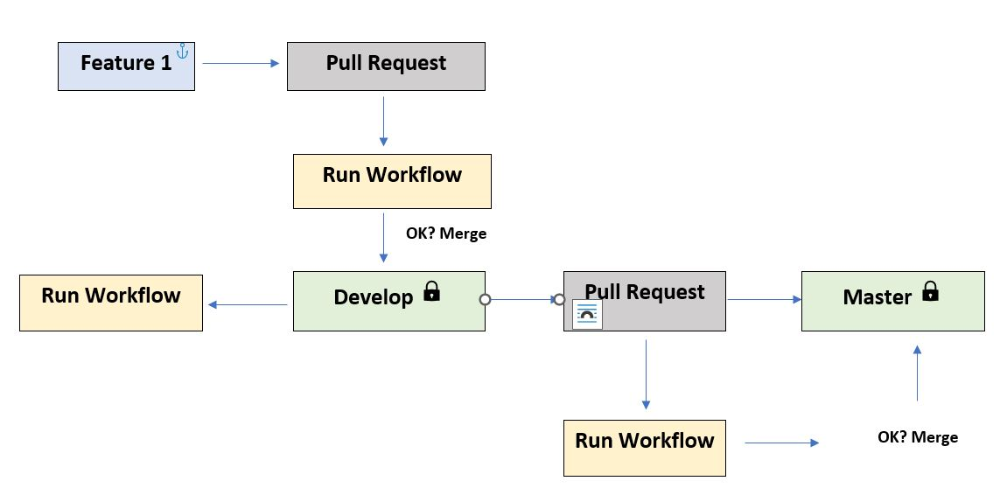
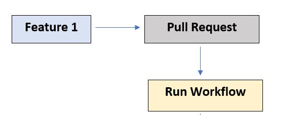
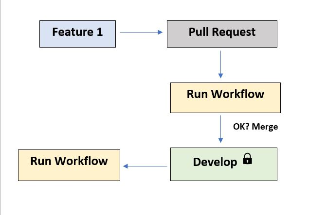

# React-app-testing-and-deployment-by-CI-CD-workflow



## Workflow



- Install Dependencies
- Check code formatting
- Run Automated Test
- Upload Code Coverage as an Artifact
- Cache Dependencies

## Develop



- Install Dependencies
- Check code formatting
- Run Automated Test
- Upload Code Coverage as an Artifact
- Build Projects
- Upload Build as an Artifact
- Deploy to Staging server
- Cache Dependencies

# Creating-Develop-Pull-Request-Workflow

`name: CI`
`on:`
`pull_request:`
`branches: [Develop]`
`jobs:`
`build:`
`runs-on: ubuntu-latest`
`steps:`
`- uses: actions/checkout@v3`
`- name: Use NodeJS`
`uses: actions/setup-node@v1`
`with:`
`node-version: "18.x"`
`- run: npm ci`
`- run: npm run format:check`
`- run: npm test -- --coverage`
`env:`
`CI: true"`

### Creating Develop Merge Request Workflow

```
push:
    branches: [Develop]

- name: Build Project
    if: github.event_name == 'push'
    run: npm run build
- name: Deploy to staging
    if: github.event_name == 'push' && github.ref == 'refs/heads/Develop'
    run: npx surge --project ./build --domain harsh-shop.surge.sh
    env:
        SURGE_LOGIN: ${{ secrets.SURGE_LOGIN }}
        SURGE_TOKEN: ${{ secrets.SURGE_TOKEN }}

```

### SURGE LOGIN

`surge whoami`

### SURGE TOEKN

`surge token`
